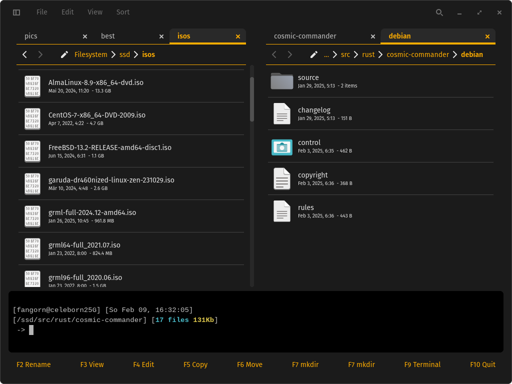

# commander

Dual Panel File manager for the COSMIC desktop environment. Think of a less cluttered Krusader.



This project is based on [COSMIC files](https://github.com/pop-os/cosmic-files) and the Terminal on [COSMIC term](https://github.com/pop-os/cosmic-term).

> [!NOTE]
> The basic functionality is working. Two panels, copying or moving files or tabs between them. A Terminal to run commands. And all the features of COSMIC Files that it inherits. Good enough to close krusader and use commander instead. Further features will be coming as needed. Or as requested by users.

## Build the project from source

```sh
# Clone the project using `git`
git clone https://github.com/fangornsrealm/commander
# Change to the directory that was created by `git`
cd commander
# Build an optimized version using `cargo`, this may take a while
cargo build --release
# Run the optimized version using `cargo`
cargo run --release
```

## License

This project is licensed under [GPLv3](LICENSE)
