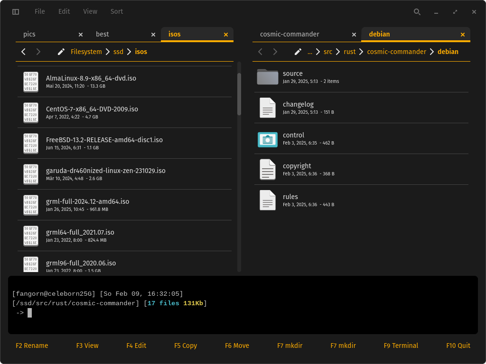

# cosmic-commander

Dual Panel File manager for the COSMIC desktop environment. Think of a less cluttered Krusader.



This project is based on [COSMIC files](https://github.com/pop-os/cosmic-files) and the Terminal on [COSMIC term](https://github.com/pop-os/cosmic-term).

> [!NOTE]
> This project is early in the development. The GUI is quite far, but the Usage is still rough. Not bad for a weekend of work, though.

## Build the project from source

```sh
# Clone the project using `git`
git clone https://github.com/fangornsrealm/cosmic-commander
# Change to the directory that was created by `git`
cd cosmic-commander
# Build an optimized version using `cargo`, this may take a while
cargo build --release
# Run the optimized version using `cargo`
cargo run --release
```

## License

This project is licensed under [GPLv3](LICENSE)
